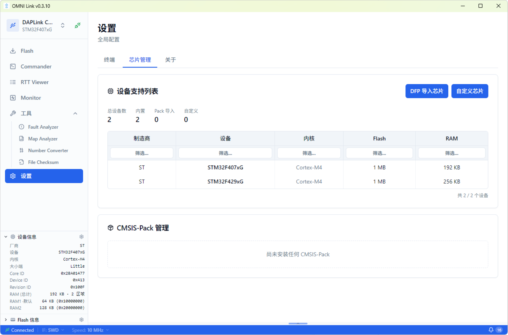

---
hide:
  - navigation
  - toc
---

<!-- ============ Hero ============ -->

  

    

      
v0.4.2 · MIT 开源 · 免费使用

      <h1 class="reveal">一站式嵌入式调试工作台</h1>
      
OMNI Link 是一站式嵌入式开发工作台，提供 Zone 调试和性能分析、 Flash 烧录、Commander 交互式命令行、RTT Viewer 实时数据收发、Monitor 变量波形监控等核心调试功能。

      

        <a class="btn btn-primary" href="https://github.com/LuckkMaker/omni-link/releases/latest">
          <svg viewBox="0 0 24 24" fill="none" stroke="currentColor" stroke-width="2.5" stroke-linecap="round" stroke-linejoin="round"><path d="M21 15v4a2 2 0 0 1-2 2H5a2 2 0 0 1-2-2v-4"/><polyline points="7 10 12 15 17 10"/><line x1="12" y1="15" x2="12" y2="3"/></svg>
          立即下载
        </a>
      

    

    

      

        

          OMNI Link — Zone 调试工作台
          
─□✕

        

        
      

    

  

<!-- ============ 功能介绍 ============ -->

  

    

      <h2>OMNI Link 功能介绍</h2>
      
从代码调试、性能分析到固件烧录，从实时日志到变量波形，每个页面都专注解决一类调试场景

    

  

  <!-- ============ Zone 调试工作台 ============ -->
  <section class="page-block" id="zone" style="padding-top:0">
    

      

        

          OMNI Link — Zone 调试工作台
          
─□✕

        

        
      

    

    

      Zone · 核心调试
      <h3>Zone 调试工作台</h3>
      
源码调试、汇编面板、寄存器、外设、调用栈、变量监视与内存查看整合进一个视图，让每一行代码的执行痕迹都触手可及。提供类似vscode 的编辑体验。

      <ul class="page-feats">
        <li><svg viewBox="0 0 24 24" fill="none" stroke="currentColor" stroke-width="3" stroke-linecap="round" stroke-linejoin="round"><polyline points="20 6 9 17 4 12"/></svg>源码浏览与编辑，断点、单步、运行控制一应俱全</li>
        <li><svg viewBox="0 0 24 24" fill="none" stroke="currentColor" stroke-width="3" stroke-linecap="round" stroke-linejoin="round"><polyline points="20 6 9 17 4 12"/></svg>反汇编、寄存器、外设寄存器实时联动</li>
        <li><svg viewBox="0 0 24 24" fill="none" stroke="currentColor" stroke-width="3" stroke-linecap="round" stroke-linejoin="round"><polyline points="20 6 9 17 4 12"/></svg>调用栈追踪与 Watch 变量监视、内存查看</li>
        <li><svg viewBox="0 0 24 24" fill="none" stroke="currentColor" stroke-width="3" stroke-linecap="round" stroke-linejoin="round"><polyline points="20 6 9 17 4 12"/></svg>Flash / RAM 占用可视化，资源消耗一目了然</li>
      </ul>
    

  </section>

  <!-- ============ Flash 烧录 ============ -->
  <section class="page-block flip" id="flash">
    

      

        

          OMNI Link — Flash 烧录
          
─□✕

        

        
      

    

    

      Flash · 固件烧录
      <h3>Flash 烧录工具</h3>
      
支持 bin / hex / elf 三种格式的固件烧录，文件直接拖拽加载，烧录快捷顺手。整片擦除与扇区擦除两种模式，烧录后自动校验，保证固件写入可靠。

      <ul class="page-feats">
        <li><svg viewBox="0 0 24 24" fill="none" stroke="currentColor" stroke-width="3" stroke-linecap="round" stroke-linejoin="round"><polyline points="20 6 9 17 4 12"/></svg>烧录、擦除（chip / sector）、校验、回读</li>
        <li><svg viewBox="0 0 24 24" fill="none" stroke="currentColor" stroke-width="3" stroke-linecap="round" stroke-linejoin="round"><polyline points="20 6 9 17 4 12"/></svg>Hex 查看器、Fill Memory、Compare 数据级比对</li>
        <li><svg viewBox="0 0 24 24" fill="none" stroke="currentColor" stroke-width="3" stroke-linecap="round" stroke-linejoin="round"><polyline points="20 6 9 17 4 12"/></svg>左侧设备面板实时显示探针与目标芯片信息</li>
      </ul>
    

  </section>

  <!-- ============ Commander ============ -->
  <section class="page-block" id="commander">
    

      

        

          OMNI Link — Commander
          
─□✕

        

        
      

    

    

      Commander · 命令行
      <h3>Commander 命令行</h3>
      
交互式 REPL，支持 GDB 调试，python 脚本运行。右侧命令面板把常用命令归类为快捷按钮，「调试」「断点调试」「解锁刷写」三套一键工作流，将多步命令链简化为单击操作。

      <ul class="page-feats">
        <li><svg viewBox="0 0 24 24" fill="none" stroke="currentColor" stroke-width="3" stroke-linecap="round" stroke-linejoin="round"><polyline points="20 6 9 17 4 12"/></svg>reg、read32 / write32、halt / continue、step、load、erase 等命令</li>
        <li><svg viewBox="0 0 24 24" fill="none" stroke="currentColor" stroke-width="3" stroke-linecap="round" stroke-linejoin="round"><polyline points="20 6 9 17 4 12"/></svg>一键工作流：调试、断点调试、解锁刷写</li>
        <li><svg viewBox="0 0 24 24" fill="none" stroke="currentColor" stroke-width="3" stroke-linecap="round" stroke-linejoin="round"><polyline points="20 6 9 17 4 12"/></svg>source 命令解决跨机器源码路径映射问题</li>
      </ul>
    

  </section>

  <!-- ============ RTT Viewer ============ -->
  <section class="page-block flip" id="rtt">
    

      

        

          OMNI Link — RTT Viewer
          
─□✕

        

        
      

    

    

      RTT · 实时日志
      <h3>RTT Viewer</h3>
      
SEGGER RTT 实时数据收发，无需额外串口即可读取目标日志。多 tab 通道管理，日志按级别着色，支持文件发送、录制到文件、HEX 发送与定时发送。

      <ul class="page-feats">
        <li><svg viewBox="0 0 24 24" fill="none" stroke="currentColor" stroke-width="3" stroke-linecap="round" stroke-linejoin="round"><polyline points="20 6 9 17 4 12"/></svg>多 tab 通道管理，terminal / bar 两种输入模式</li>
        <li><svg viewBox="0 0 24 24" fill="none" stroke="currentColor" stroke-width="3" stroke-linecap="round" stroke-linejoin="round"><polyline points="20 6 9 17 4 12"/></svg>日志按 info / debug / warn / error 级别着色</li>
        <li><svg viewBox="0 0 24 24" fill="none" stroke="currentColor" stroke-width="3" stroke-linecap="round" stroke-linejoin="round"><polyline points="20 6 9 17 4 12"/></svg>会话在应用顶层启用，切换页面不中断数据流</li>
      </ul>
    

  </section>

  <!-- ============ Monitor ============ -->
  <section class="page-block" id="monitor">
    

      

        

          OMNI Link — Monitor
          
─□✕

        

        
      

    

    

      Monitor · 变量监控
      <h3>Monitor 变量监控</h3>
      
通过 DWARF 符号解析自动从 ELF 文件提取变量地址，提供 SWD（非侵入式）与 RTT（高速）两种传输方式。波形图基于 uPlot 渲染，支持触发、游标测量与 CSV 导出。

      <ul class="page-feats">
        <li><svg viewBox="0 0 24 24" fill="none" stroke="currentColor" stroke-width="3" stroke-linecap="round" stroke-linejoin="round"><polyline points="20 6 9 17 4 12"/></svg>变量树按源文件分组，勾选即可加入监视列表</li>
        <li><svg viewBox="0 0 24 24" fill="none" stroke="currentColor" stroke-width="3" stroke-linecap="round" stroke-linejoin="round"><polyline points="20 6 9 17 4 12"/></svg>上升沿 / 下降沿 / 阈值触发，游标测量</li>
        <li><svg viewBox="0 0 24 24" fill="none" stroke="currentColor" stroke-width="3" stroke-linecap="round" stroke-linejoin="round"><polyline points="20 6 9 17 4 12"/></svg>底部表格实时显示当前值、最值与移动均值</li>
      </ul>
    

  </section>

  <!-- ============ 工具集 ============ -->
  <section class="omni-section" id="tools" style="padding-top:0">
    

      Tools · 工具集
      <h2>实用工具，随手可用</h2>
      
四个独立小工具，覆盖故障分析、内存占用、进制转换与文件校验

    

    

      

        

          
        

        

          <h4><svg viewBox="0 0 24 24" fill="none" stroke="currentColor" stroke-width="2" stroke-linecap="round" stroke-linejoin="round"><path d="M10.29 3.86L1.82 18a2 2 0 0 0 1.71 3h16.94a2 2 0 0 0 1.71-3L13.71 3.86a2 2 0 0 0-3.42 0z"/><line x1="12" y1="9" x2="12" y2="13"/><line x1="12" y1="17" x2="12.01" y2="17"/></svg>Fault Analyzer</h4>
          
Cortex-M 故障寄存器分析，解析 CFSR / HFSR / MMFSR / BFSR / UFSR，快速定位 HardFault / BusFault / UsageFault 成因。

        

      

      

        

          
        

        

          <h4><svg viewBox="0 0 24 24" fill="none" stroke="currentColor" stroke-width="2" stroke-linecap="round" stroke-linejoin="round"><line x1="18" y1="20" x2="18" y2="10"/><line x1="12" y1="20" x2="12" y2="4"/><line x1="6" y1="20" x2="6" y2="14"/></svg>Map Analyzer</h4>
          
ARM .map 链接器输出文件解析与可视化，分析 ROM / RAM / Stack 占用分布，Top 15 模块占用排行。

        

      

      

        

          
        

        

          <h4><svg viewBox="0 0 24 24" fill="none" stroke="currentColor" stroke-width="2" stroke-linecap="round" stroke-linejoin="round"><rect x="2" y="6" width="20" height="12" rx="2"/><path d="M8 10h.01M12 10h.01M16 10h.01M8 14h.01M12 14h.01M16 14h.01"/></svg>Number Converter</h4>
          
十进制 / 十六进制 / 二进制实时联动转换，32 位位网格逐位点击编辑，同步显示字节分解与 ASCII。

        

      

      

        

          
        

        

          <h4><svg viewBox="0 0 24 24" fill="none" stroke="currentColor" stroke-width="2" stroke-linecap="round" stroke-linejoin="round"><path d="M9 11l3 3L22 4"/><path d="M21 12v7a2 2 0 0 1-2 2H5a2 2 0 0 1-2-2V5a2 2 0 0 1 2-2h11"/></svg>File Checksum</h4>
          
CRC32 / MD5 / SHA-1 / SHA-256 校验和计算，快速核对固件文件完整性。

        

      

    

  </section>

  <!-- ============ 设置 ============ -->
  <section class="page-block" id="settings" style="border-top:1px solid var(--border)">
    

      

        

          OMNI Link — 设置
          
─□✕

        

        
      

    

    

      Settings · 设置
      <h3>设置与芯片管理</h3>
      
支持通过厂商提供的 Keil Pack 包扩展芯片型号，在「芯片管理」中选择 DFP 导入即可，对尝鲜新片子非常友好。同时可配置终端主题、查看版本信息。

      <ul class="page-feats">
        <li><svg viewBox="0 0 24 24" fill="none" stroke="currentColor" stroke-width="3" stroke-linecap="round" stroke-linejoin="round"><polyline points="20 6 9 17 4 12"/></svg>Keil Pack（DFP）一键导入扩展芯片支持</li>
        <li><svg viewBox="0 0 24 24" fill="none" stroke="currentColor" stroke-width="3" stroke-linecap="round" stroke-linejoin="round"><polyline points="20 6 9 17 4 12"/></svg>支持 STM32、GD32、APM32、NXP 等 Cortex-M 系列</li>
        <li><svg viewBox="0 0 24 24" fill="none" stroke="currentColor" stroke-width="3" stroke-linecap="round" stroke-linejoin="round"><polyline points="20 6 9 17 4 12"/></svg>终端主题与个性化设置</li>
      </ul>
    

  </section>

