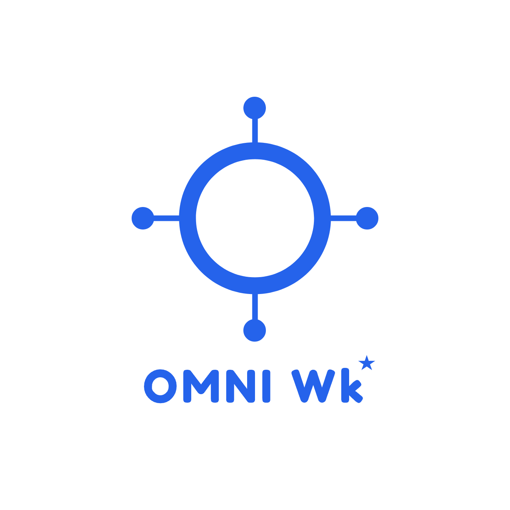
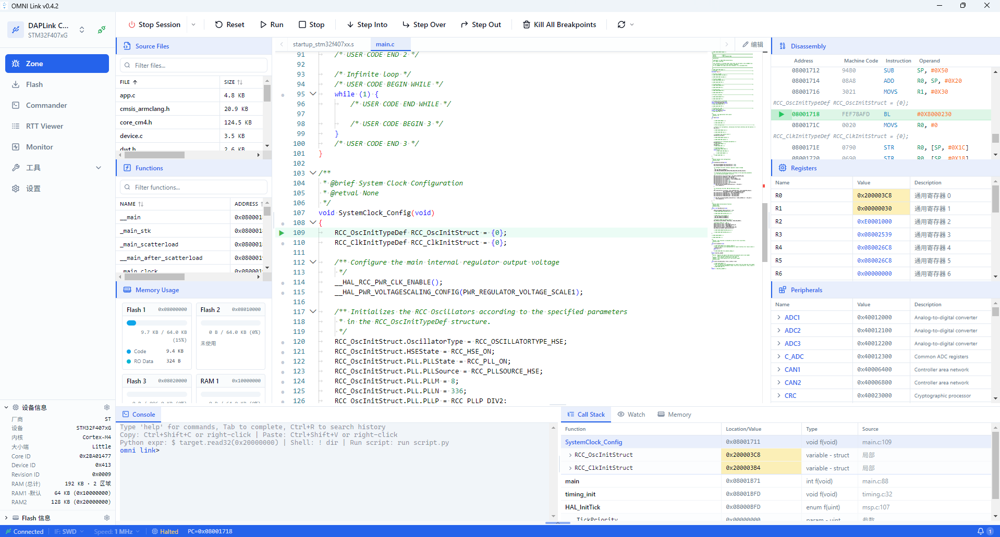
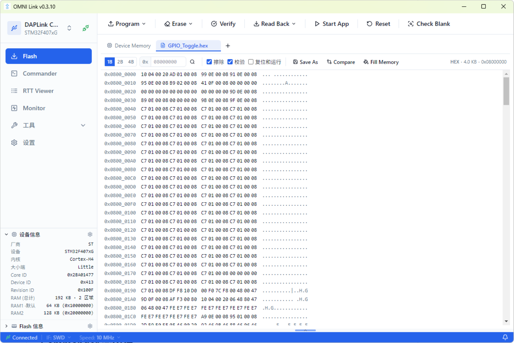
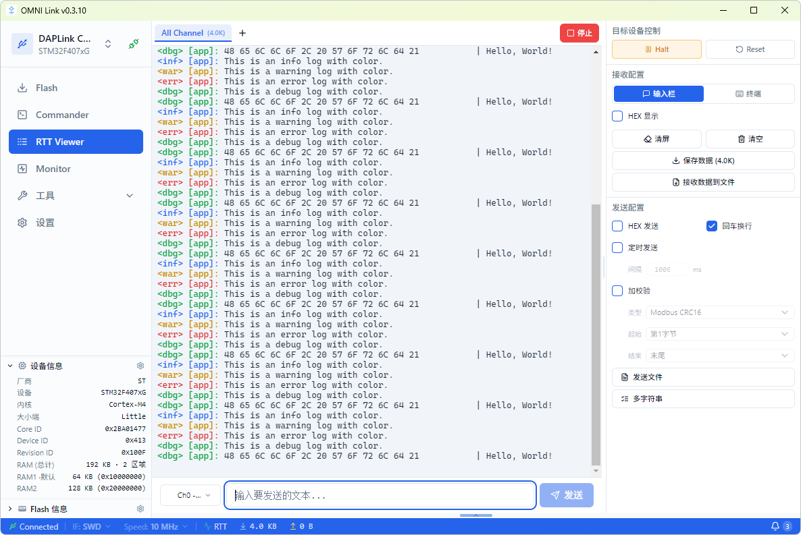

---
hide:
  - navigation
  - toc
---

<!-- ============ Hero（全局背景图） ============ -->

  

    
v0.4.2 · MIT 开源 · 免费使用

    <h1 class="reveal">一站式嵌入式调试工作台</h1>
    
把烧录、命令行调试、RTT 日志、变量波形监控等散落在多个工具里的能力，整合进一个工作台。支持 DAPLink / ST-Link / J-Link，无需额外购买专用调试硬件。

    

      <a class="btn btn-primary" href="https://github.com/LuckkMaker/omni-link/releases/latest">
        <svg viewBox="0 0 24 24" fill="none" stroke="currentColor" stroke-width="2.5" stroke-linecap="round" stroke-linejoin="round"><path d="M21 15v4a2 2 0 0 1-2 2H5a2 2 0 0 1-2-2v-4"/><polyline points="7 10 12 15 17 10"/><line x1="12" y1="15" x2="12" y2="3"/></svg>
        立即下载
      </a>
      <a class="btn btn-secondary" href="features/">
        <svg viewBox="0 0 24 24" fill="none" stroke="currentColor" stroke-width="2" stroke-linecap="round" stroke-linejoin="round"><path d="M2 3h6a4 4 0 0 1 4 4v14a3 3 0 0 0-3-3H2z"/><path d="M22 3h-6a4 4 0 0 0-4 4v14a3 3 0 0 1 3-3h7z"/></svg>
        功能介绍
      </a>
    

  

<!-- ============ 特性 ============ -->

  

    

      <h2>一个工作台，搞定所有调试环节</h2>
      
面向嵌入式开发者的全能调试工具集，覆盖从代码调试到固件烧录的完整链路

    

    

      

        

          <svg viewBox="0 0 24 24" fill="none" stroke="currentColor" stroke-width="2" stroke-linecap="round" stroke-linejoin="round"><path d="M8 9l-3 3 3 3M16 9l3 3-3 3"/><line x1="12" y1="5" x2="12" y2="19"/></svg>
        

        <h3>Zone 调试工作台</h3>
        
源码调试、反汇编、寄存器、外设、调用栈、Watch 变量监视与内存查看整合于一个视图，全链路可视化调试。

        <a class="more" href="features/#zone">了解详情 →</a>
      

      

        

          <svg viewBox="0 0 24 24" fill="none" stroke="currentColor" stroke-width="2" stroke-linecap="round" stroke-linejoin="round"><polygon points="13 2 3 14 12 14 11 22 21 10 12 10 13 2"/></svg>
        

        <h3>Flash 烧录工具</h3>
        
bin / hex / elf 固件烧录，整片与扇区擦除、自动校验、Hex 查看器、Fill Memory、Compare，文件拖拽即烧。

        <a class="more" href="features/#flash">了解详情 →</a>
      

      

        

          <svg viewBox="0 0 24 24" fill="none" stroke="currentColor" stroke-width="2" stroke-linecap="round" stroke-linejoin="round"><polyline points="4 17 10 11 4 5"/><line x1="12" y1="19" x2="20" y2="19"/></svg>
        

        <h3>Commander 命令行</h3>
        
交互式 REPL，命令参考表与「调试」「断点调试」「解锁刷写」一键工作流，多步操作链单击完成。

        <a class="more" href="features/#commander">了解详情 →</a>
      

      

        

          <svg viewBox="0 0 24 24" fill="none" stroke="currentColor" stroke-width="2" stroke-linecap="round" stroke-linejoin="round"><polyline points="22 12 18 12 15 21 9 3 6 12 2 12"/></svg>
        

        <h3>RTT Viewer</h3>
        
SEGGER RTT 实时数据收发，多 tab 通道管理，日志级别着色，文件发送与录制，切换页面不中断数据流。

        <a class="more" href="features/#rtt">了解详情 →</a>
      

      

        

          <svg viewBox="0 0 24 24" fill="none" stroke="currentColor" stroke-width="2" stroke-linecap="round" stroke-linejoin="round"><line x1="18" y1="20" x2="18" y2="10"/><line x1="12" y1="20" x2="12" y2="4"/><line x1="6" y1="20" x2="6" y2="14"/></svg>
        

        <h3>Monitor 变量监控</h3>
        
DWARF 符号解析自动提取变量地址，SWD / RTT 双传输，uPlot 波形图、触发、游标测量、CSV 导出。

        <a class="more" href="features/#monitor">了解详情 →</a>
      

      

        

          <svg viewBox="0 0 24 24" fill="none" stroke="currentColor" stroke-width="2" stroke-linecap="round" stroke-linejoin="round"><rect x="4" y="4" width="16" height="16" rx="2"/><rect x="9" y="9" width="6" height="6"/><line x1="9" y1="1" x2="9" y2="4"/><line x1="15" y1="1" x2="15" y2="4"/><line x1="9" y1="20" x2="9" y2="23"/><line x1="15" y1="20" x2="15" y2="23"/><line x1="20" y1="9" x2="23" y2="9"/><line x1="20" y1="14" x2="23" y2="14"/><line x1="1" y1="9" x2="4" y2="9"/><line x1="1" y1="14" x2="4" y2="14"/></svg>
        

        <h3>工具集与芯片扩展</h3>
        
Fault / Map Analyzer、进制转换、文件校验，配合 Keil Pack 导入扩展 STM32、GD32、NXP 等芯片支持。

        <a class="more" href="features/#tools">了解详情 →</a>
      

    

  

<!-- ============ 功能介绍 ============ -->

  

    

      <h2>OMNI Link 功能介绍</h2>
      
四大核心页面，覆盖嵌入式调试的完整链路

    

    

      

        

          

            Zone 调试工作台
            
─□✕

          

          
        

        

          <h3>Zone 调试工作台</h3>
          
源码调试、反汇编、寄存器、外设、调用栈、Watch 变量监视与内存查看整合于一个视图，全链路可视化调试。

          <a class="more" href="features/#zone">了解详情 →</a>
        

      

      

        

          

            Flash 烧录工具
            
─□✕

          

          
        

        

          <h3>Flash 烧录工具</h3>
          
bin / hex / elf 固件烧录，整片与扇区擦除、自动校验、Hex 查看器，文件拖拽即烧。

          <a class="more" href="features/#flash">了解详情 →</a>
        

      

      

        

          

            RTT Viewer
            
─□✕

          

          
        

        

          <h3>RTT Viewer</h3>
          
SEGGER RTT 实时数据收发，多 tab 通道管理，日志级别着色，切换页面不中断数据流。

          <a class="more" href="features/#rtt">了解详情 →</a>
        

      

      

        

          

            Monitor 变量监控
            
─□✕

          

          
        

        

          <h3>Monitor 变量监控</h3>
          
DWARF 符号解析自动提取变量地址，SWD / RTT 双传输，uPlot 波形图、触发与 CSV 导出。

          <a class="more" href="features/#monitor">了解详情 →</a>
        

      

    

  

<!-- ============ 下载 ============ -->

  

    

      <h2>免费下载，即刻开始</h2>
      
MIT 开源协议，可自由使用与分发

    

    

      

        

          <svg viewBox="0 0 24 24" fill="none" stroke="currentColor" stroke-width="2" stroke-linecap="round" stroke-linejoin="round"><path d="M21 15v4a2 2 0 0 1-2 2H5a2 2 0 0 1-2-2v-4"/><polyline points="7 10 12 15 17 10"/><line x1="12" y1="15" x2="12" y2="3"/></svg>
        

        <h3>OMNI Link for Windows</h3>
        
v0.4.2 · x64 · NSIS 安装包

        <a class="dl-btn" href="https://github.com/LuckkMaker/omni-link/releases/latest">
          <svg viewBox="0 0 24 24" fill="none" stroke="currentColor" stroke-width="2.5" stroke-linecap="round" stroke-linejoin="round"><path d="M21 15v4a2 2 0 0 1-2 2H5a2 2 0 0 1-2-2v-4"/><polyline points="7 10 12 15 17 10"/><line x1="12" y1="15" x2="12" y2="3"/></svg>
          下载 Windows 安装包
        </a>
        
查看全部版本与更新日志 → <a href="https://github.com/LuckkMaker/omni-link/releases">GitHub Releases</a>

      

      

        <ul class="dl-list">
          <li>
            <svg viewBox="0 0 24 24" fill="none" stroke="currentColor" stroke-width="3" stroke-linecap="round" stroke-linejoin="round"><polyline points="20 6 9 17 4 12"/></svg>
            
<strong>Windows 10 或更高版本</strong>x64 架构，NSIS 安装向导，支持自定义安装目录

          </li>
          <li>
            <svg viewBox="0 0 24 24" fill="none" stroke="currentColor" stroke-width="3" stroke-linecap="round" stroke-linejoin="round"><polyline points="20 6 9 17 4 12"/></svg>
            
<strong>调试器支持</strong>DAPLink / CMSIS-DAP（v1 / v2）、ST-Link、J-Link

          </li>
          <li>
            <svg viewBox="0 0 24 24" fill="none" stroke="currentColor" stroke-width="3" stroke-linecap="round" stroke-linejoin="round"><polyline points="20 6 9 17 4 12"/></svg>
            
<strong>目标芯片</strong>STM32、GD32、APM32、NXP 等 Cortex-M 系列，Keil Pack 扩展

          </li>
        </ul>
      

    

  

