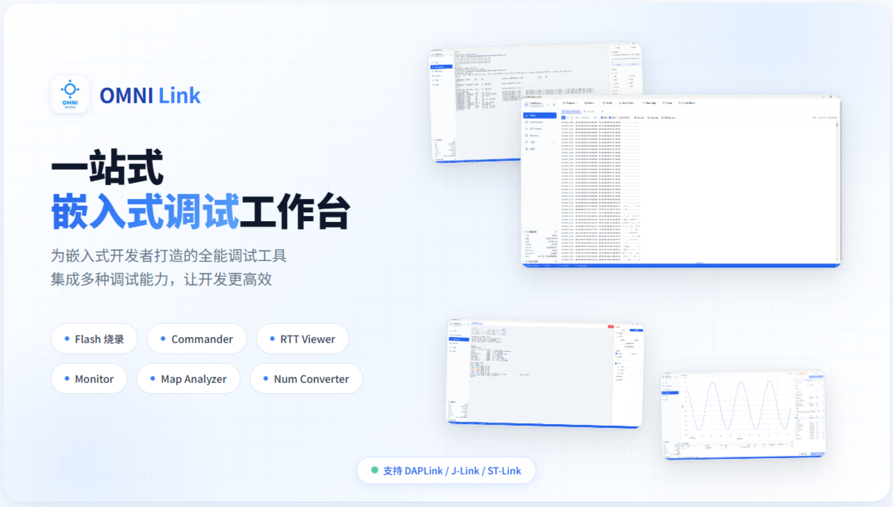
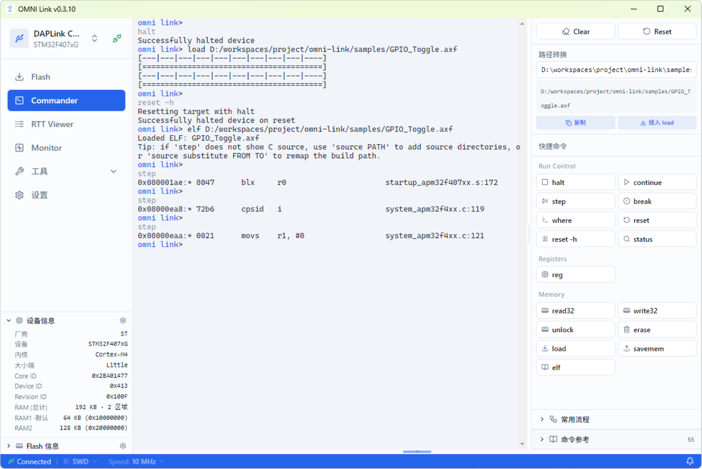
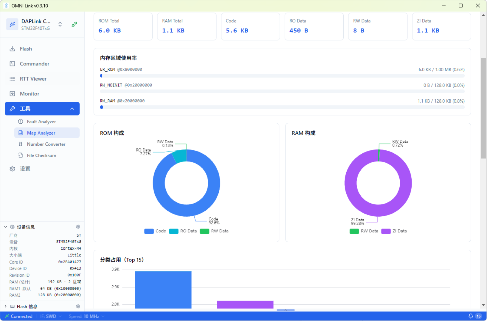
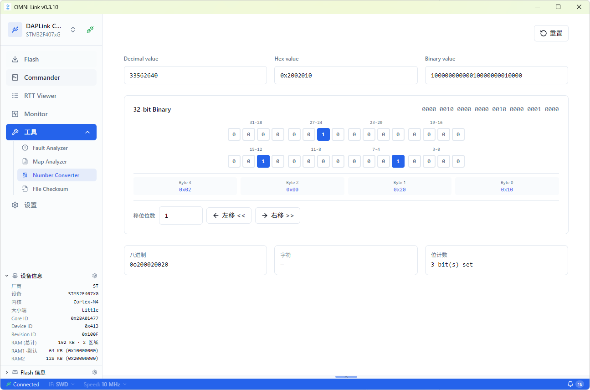

# OMNI Link

OMNI Link 是一站式嵌入式开发工作台，提供 Flash 烧录、Commander 交互式命令行、RTT Viewer 实时数据收发、Monitor 变量波形监控等核心调试功能。



## 项目简介

OMNI Link 是一个跨平台桌面应用，把烧录、命令行调试、RTT 日志、变量波形监控等平时散落在多个工具里的能力，整合进一个工作台。支持 DAPLink / ST-Link / J-Link 等常见主流调试器，无需额外购买专用调试硬件。

支持常见主流 Arm Cortex-M MCU，包括 STM32、GD32、APM32、NXP 等系列。若目标芯片不在内置列表里，可通过厂商提供的 Keil Pack 包导入来扩展支持，对尝鲜新片子很友好。

## 功能概览

| 模块 | 说明 |
|------|------|
| Flash 烧录工具 | 固件烧录、擦除（chip/sector）、校验、回读、Hex 查看器、Fill Memory、Compare |
| Commander 命令行 | 交互式 REPL，命令参考表、一键工作流、`source` 命令配置源码路径 |
| RTT Viewer | SEGGER RTT 实时数据收发，多 tab 通道管理，文件发送/接收数据到文件 |
| Monitor 变量监控 | DWARF 符号解析、SWD/RTT 传输、uPlot 波形图、触发、游标测量 |
| Tools 工具集 | Fault Analyzer、Map Analyzer、Number Converter、File Checksum |

### Flash 烧录工具

固件烧录、擦除（chip/sector）、校验、回读、Hex 查看器、Fill Memory、Compare 等功能，支持 `bin` / `hex` / `elf` 三种格式，文件可直接拖拽加载，烧录快捷顺手。


### Commander 命令行

交互式 REPL，支持 `reg`、`read32`/`write32`、`halt`/`continue`、`step`、`load`、`erase`、`disasm`、`where` 等命令。右侧命令面板提供命令参考表与一键工作流，「调试」「断点调试」「解锁刷写」多步操作链可单击完成。`source` 命令解决跨机器源码路径映射问题。



### RTT Viewer

SEGGER RTT 实时数据收发，多 tab 通道管理，日志按级别着色，支持文件发送、接收数据到文件、HEX 发送、定时发送等。RTT 会话在应用顶层启用，切换页面不中断数据流。


### Monitor 变量监控

DWARF 符号解析自动提取变量地址，SWD（HSS 非侵入式）与 RTT（侵入式高速）两种传输方式，uPlot 波形图、上升沿/下降沿/阈值触发、游标测量、CSV 导出。


### Tools 工具集

- **Fault Analyzer** — Cortex-M 故障寄存器分析，定位 HardFault / BusFault / UsageFault 成因
- **Map Analyzer** — ARM `.map` 文件解析，可视化 ROM / RAM / Stack 占用
- **Number Converter** — 十进制/十六进制/二进制联动转换，32 位位网格编辑
- **File Checksum** — CRC32 / MD5 / SHA-1 / SHA-256 校验和计算






## 支持的调试器与芯片

- **DAPLink / CMSIS-DAP**（v1 / v2）— 便宜、开源、还能自己做
- **ST-Link** — 玩 STM32 的人手至少一个
- **J-Link** — 如果手头有，也能直接用

芯片支持常见主流 Arm Cortex-M 系列，并通过 Keil Pack 包扩展新芯片支持，详见 [快速开始](getting-started.md)。

## 快速开始

最省事的用法是直接去 [GitHub Releases](https://github.com/LuckkMaker/omni-link/releases/latest) 下载安装包。从源码构建则需 Node.js 20+ 与 Python 3.11+：

```bash
npm install
npm run python:install
npm run dev
```

详细步骤见 [快速开始](getting-started.md) 或 [GitHub 仓库 README](https://github.com/LuckkMaker/omni-link#readme)。

## 许可证

MIT License，Copyright (c) 2026 LuckkMaker。